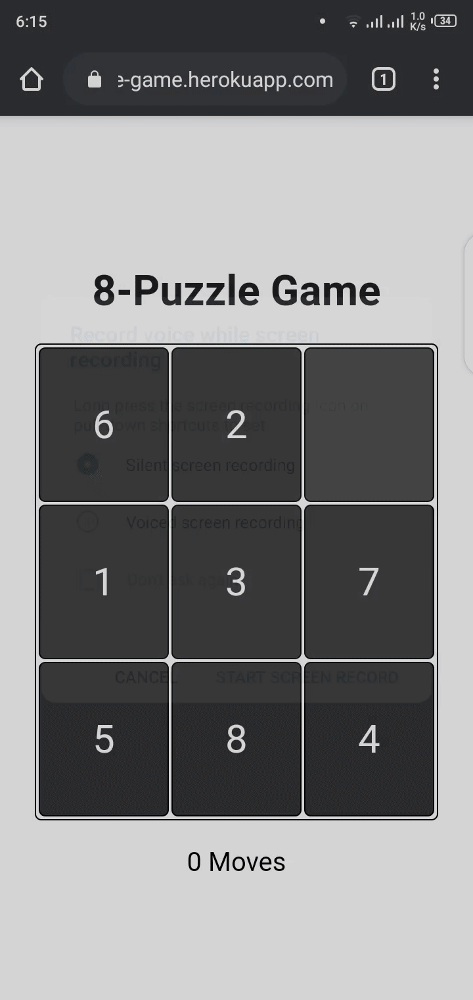

# 8-Puzzle Game

[](https://travis-ci.com/kerolloz/8-puzzle)

> A simple VueJS game

[**https://kerolloz.github.io/8-puzzle/**](https://kerolloz.github.io/8-puzzle/)

<div align="center">
  
</div>

## Project setup

```shell
npm install
```

### Compiles and hot-reloads for development

```shell
npm run serve
```

### Compiles and minifies for production

```shell
npm run build
```

### Lints and fixes files

```shell
npm run lint
```

### Customize configuration

See [Configuration Reference](https://cli.vuejs.org/config/).
